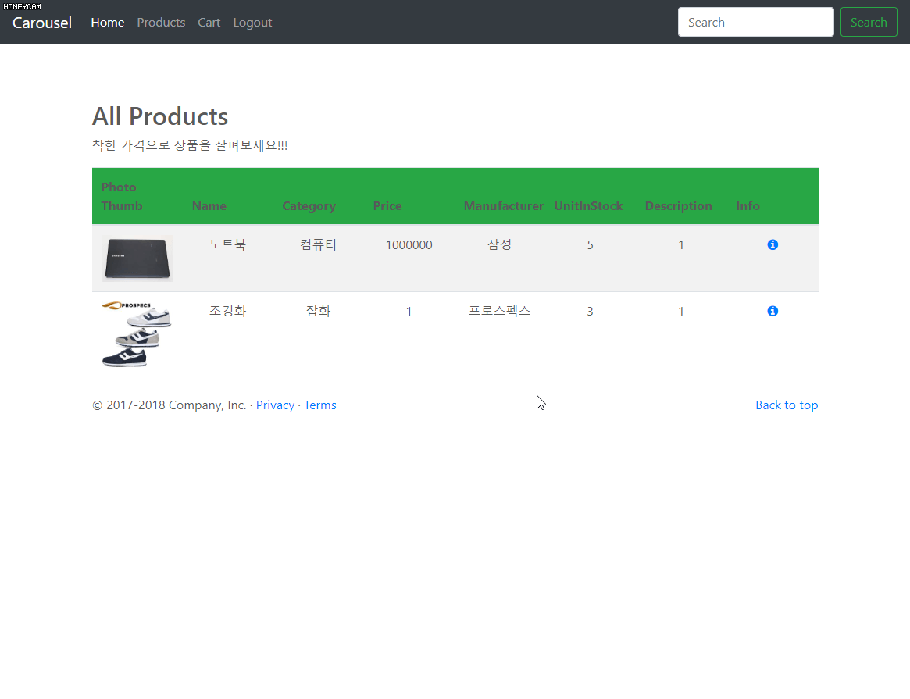

# eStore (Spring-Boot Project)

> Wiki에 각 commit 기록에 따른 프로젝트의 진행 별 설명을 기록

This project is a shopping mall using the Spring framework.

## Register

## Login

## Show Products

## AddCart

## Cart

## Admin

## AddProduct

## DeleteProduct

## UpdateProduct

